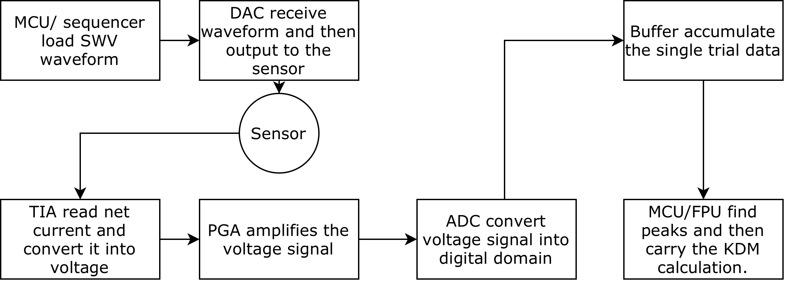

# NanoStat

NanoStat is a battery-powered, BLE-connected portable potentiostat built around an Analog Devices AD5941 analogue front end, a Nordic nRF52840 wireless microcontroller, and an Nordic nPM1300 power-management IC. The implemented system generates square-wave voltammetry (SWV) excitation, acquires current from a three-electrode electrochemical cell, and transfers measurements to a browser interface.

Cortisol aptasensing in phosphate-buffered saline (PBS) was used as the application case. The hardware is intended as a reusable electrochemical reader: sensor chemistry provides analyte selectivity, while NanoStat supplies the excitation, current readout, timing, storage, power management, and wireless interface.



## Repository Contents

| Path | Contents |
|---|---|
| [`firmware/`](firmware/) | Zephyr/nRF Connect SDK application, NanoStat board definition, and the ADI AD5940/AD5941 driver library |
| [`hardware/`](hardware/) | BOM, schematic exports, PCB layout PDF, and interface screenshots |
| [`webapp/`](webapp/) | Browser-based BLE control, plotting, and CSV export application |
| [`experiments/`](experiments/) | Raw data, analysis scripts, derived tables, and figures for electrical, system, and sensor validation |
| [`docs/`](docs/) | Architecture, subsystem, validation, reproducibility, and limitation notes |
| [`reports/`](reports/) | Final dissertation and poster PDFs |

## Implemented Measurement Chain

1. A phone or computer configures an SWV measurement over BLE.
2. The nRF52840 configures the AD5941 and starts its hardware sequencer.
3. The AD5941 applies the programmed potential between the working and reference electrodes.
4. The transimpedance path converts working-electrode current to voltage for ADC acquisition.
5. The nRF52840 drains the AD5941 FIFO over SPI, extracts forward and reverse endpoint currents, and forms the differential SWV curve.
6. Results are transmitted over BLE for plotting and CSV export.
7. The electrode path is released to a high-impedance state after measurement.

The validated protocol scans approximately `-450 mV` to `0 mV` at `120 Hz` with approximately `70 mV` peak-to-peak square-wave modulation. Fine-step segmented scans were also implemented, although the present `1 mV` mode contains inter-segment timing gaps and is not a fully continuous scan.

## Key Validation Results

The values below describe the tested configurations, not universal specifications over every AD5941 range and gain setting.

| Validation | Main result |
|---|---|
| Known-load current | A `0.995 MOhm` dummy resistor gives a theoretical `70.19 nA`; NanoStat measured approximately `69.5-69.7 nA`, below `1%` error at this operating point |
| Repeatability | Run-to-run SD ranged from `0.057 nA` to `0.146 nA` across the tested step settings |
| Excitation waveform | NI myDAQ captures confirmed staircase increments and approximately `69.7 mV` peak-to-peak modulation; residual plateau RMSE after registration was approximately `0.1 mV` |
| High-impedance release | External voltage capture and firmware-state evidence show that the electrode path is opened and measurement blocks are disabled after a scan |
| Power-source sensitivity | Battery and floating USB operation were similar; a mains-connected laptop introduced much larger noise through the USB-coupled setup |
| BLE range | Stable operation was observed to `18 m` in an unobstructed corridor, with connection possible at approximately `28 m` under those favourable conditions |
| Sensor proof of concept | Methylene-blue peaks were resolved in PBS; the clearest response occurred at the highest tested cortisol concentration, while lower concentrations were not reliably separated from blank variability |

See [`docs/validation_summary.md`](docs/validation_summary.md) for the evidence boundaries and links to each dataset.

For concise technical answers about the ADC, filters, TIA gain, FIFO, guard structures, and sensor interpretation, see [`docs/technical_faq.md`](docs/technical_faq.md).

## Firmware Build

The firmware was developed with nRF Connect SDK `v2.9.0` for the custom `NanoStat` board.

```bash
cd firmware
west build -b NanoStat/nrf52840 . -- -DBOARD_ROOT="$PWD"
west flash
```

The exact board identifier accepted by a local Zephyr installation can depend on how custom board roots are configured. If automatic discovery fails, pass the board root explicitly:

```bash
west build -p always -b NanoStat/nrf52840 . -- -DBOARD_ROOT="$PWD"
```

More detail is provided in [`firmware/README.md`](firmware/README.md).

## Web Application

The Web Bluetooth interface is in [`webapp/index.html`](webapp/index.html). Serve the directory from `localhost` and open it in a Chromium-based desktop browser:

```bash
cd webapp
python3 -m http.server 8000
```

Then open `http://localhost:8000`. Web Bluetooth support depends on the browser and operating system; Chrome on iOS/iPadOS does not expose the required Web Bluetooth API.

## Data Reproduction

Most figures can be regenerated by running the Python script stored beside its data. The analysis uses `numpy`, `pandas`, `matplotlib`, and `scipy` where required.

```bash
python3 -m venv .venv
source .venv/bin/activate
pip install -r analysis_requirements.txt
```

Start with [`experiments/README.md`](experiments/README.md) and [`docs/data_and_reproducibility.md`](docs/data_and_reproducibility.md).

## Important Boundaries

- The sensor study is a proof of concept in PBS, not a completed cortisol calibration or clinical diagnostic validation.
- Saliva was not tested.
- A chemical limit of detection was not established.
- Battery lifetime is modelled from measured active-stage currents and the nPM1300 data-sheet ship-mode current; it was not verified by a complete discharge test.
- The buffered guard structures were designed to reduce leakage risk in future higher-impedance configurations. Their isolated contribution was not measured with a guard-on/guard-off experiment.
- Native schematic and PCB design files were not present in the archived project folder. This repository therefore contains the available BOM, schematic images, and PCB layout PDF exports.

## Citation and Licensing

Citation metadata is provided in [`CITATION.cff`](CITATION.cff).

No project-wide open-source licence has been assigned. Third-party files retain their original licences; in particular, the Analog Devices library under [`firmware/lib/ad5940lib/`](firmware/lib/ad5940lib/) is governed by its included licence. See [`NOTICE.md`](NOTICE.md) before redistributing or reusing the project.
